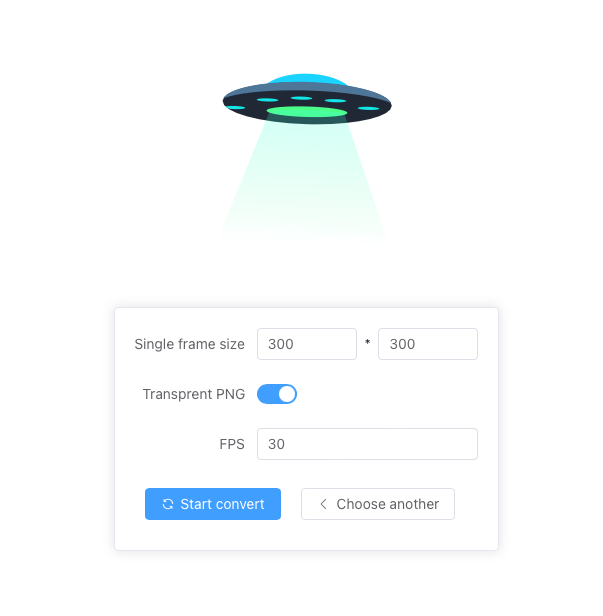
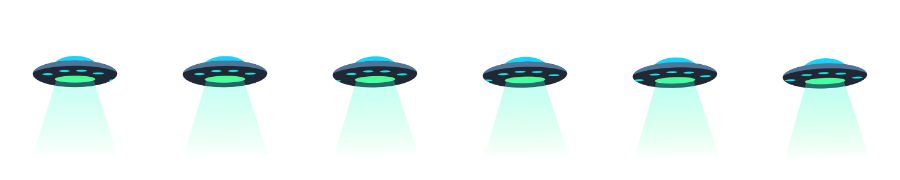

# lottie-to-png-sequence
A tool that can convert lottie to png sequence frames



output a single sequenced frame png:




# Online preview
[Amazingjs lottie-to-png-sequence](https://amazingjs.cn/lottie-to-png-sequence/)


# DEV & Build
```bash
# dev
npm run dev
# build
vite build --base=/lottie-to-png-sequence
```